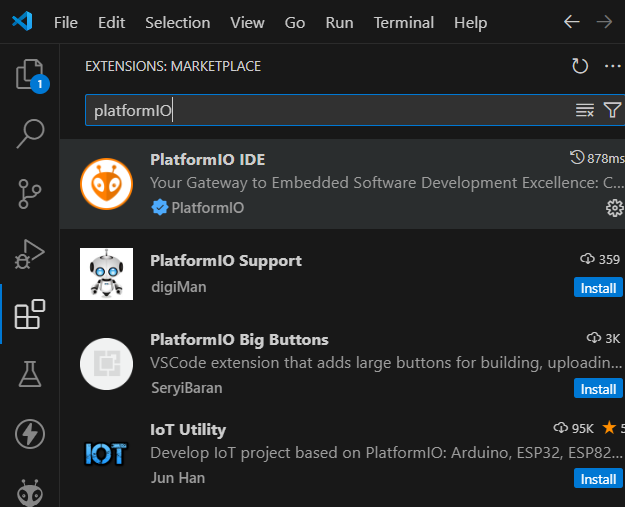
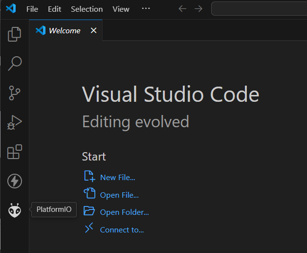
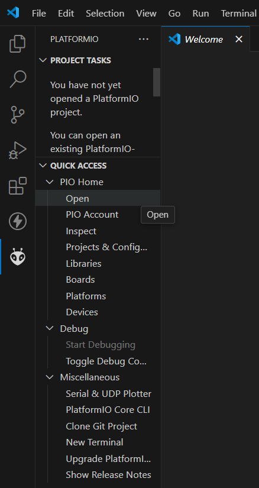
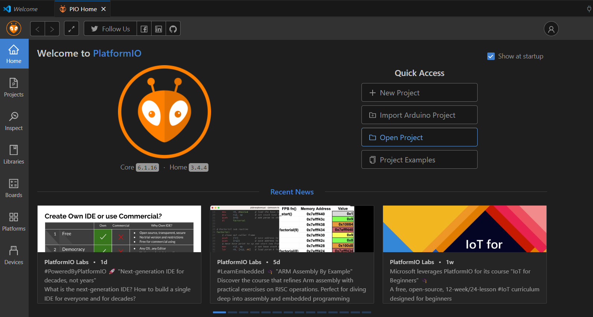
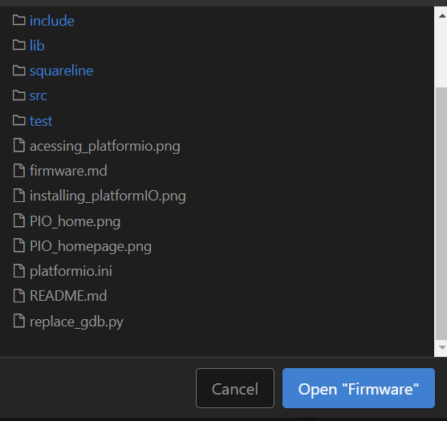
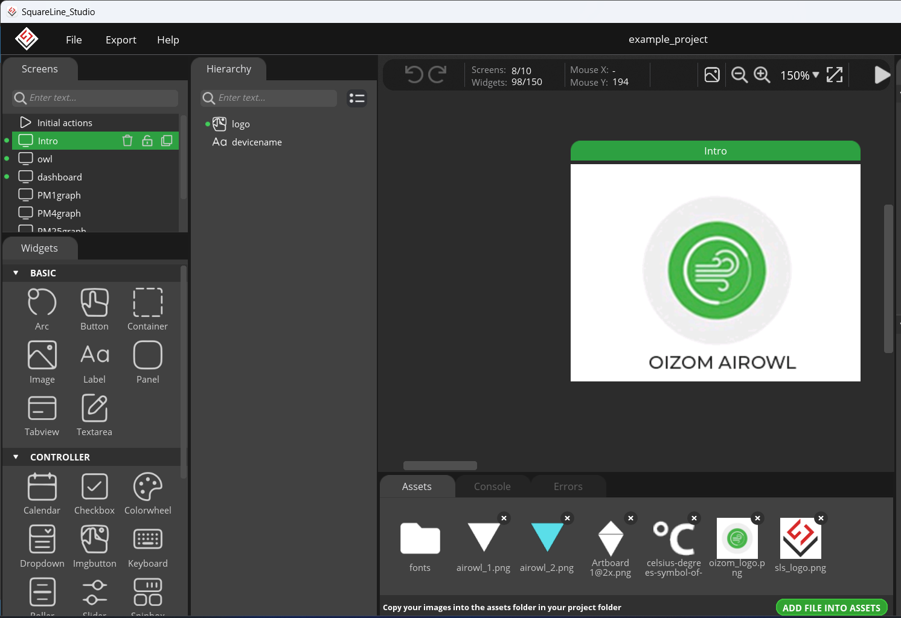
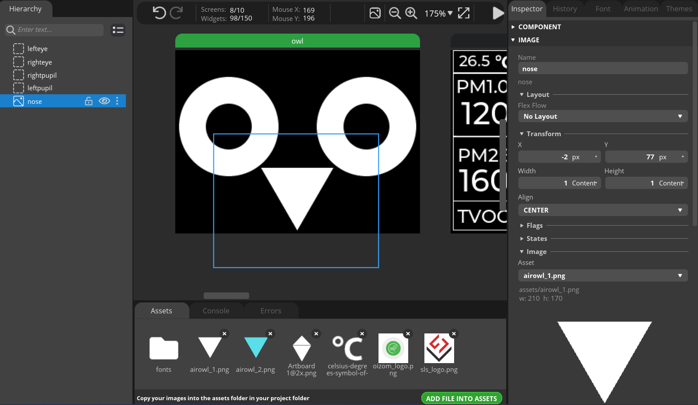
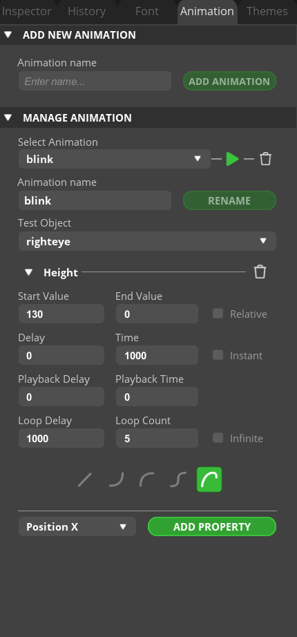
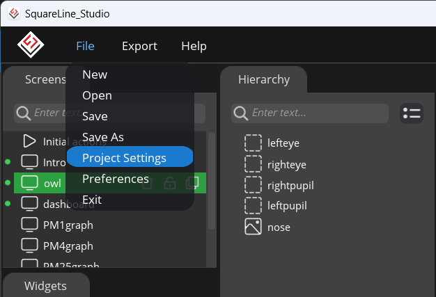
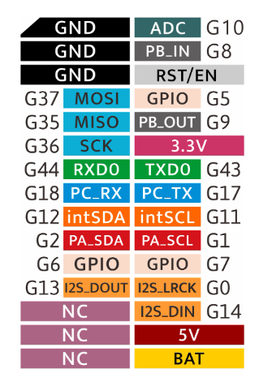

# Firmware

This folder contains the firmware files used to program the Airowl. The Folder consists of various folders used by PlatformIO to configure and program the project.

## Using PlatformIO
PlatformIO is a VS code extension that enables us to program microcontrollers using VS code. The PlatformIO core supports more than 1500 development boards including the M5 core S3 used in the Airowl. PlatformIO supports both esp-idf and arduino environments. 

### Step 1  Installing PlatformIO 
PlatformIO can be installed using the extensions feature in Visual Studio Code.
 

### Step 2 Using PlatformIO with Airowl Firmware

In order to program the Airowl with the firmware, download and extract this repository or clone it.
Open platformIO using the platformIO icon from the sidebar.

Open PIO home to access platformIO, this opens a new tab in VS code which can be used to create/open projects.

Click on Open Project button as highlighted in the above picture and locate the downloaded repository, and open the Firmware folder. Ensure that the folder has platformio.ini file present in it as this file acts as the config file for platformio and is essential to program the firmware to the Airowl. 

## ⚙️ Enabling Matter Support on Airowl

### 📂 Step A: Add the Matter Library
1. Go to the following directory:

- **For Ubuntu :** /home/.platformio/packages/framework-arduinoespressif32/libraries
- **For Mac :** 
- **For Windows :** C:\Users\"user"\.platformio\packages\framework-arduinoespressif32\libraries

2. Inside the `libraries` folder, locate or create a folder named **Matter**.
3. Copy the **Matter** folder from the source code (`/Firmware/Matter`) and paste it inside `libraries/Matter`.

### 🔄 Step B: Build the Firmware
1. After adding the Matter library, **build** the firmware in PlatformIO.

🚀 **Your Airowl device now supports Matter and is ready for smart home integration!**

---

### Step 3  Uploading to the device using PlatformIO

Once the platformio.ini file is loaded, ensure that Airowl is connected to your PC, and upload the firmware using the PlatformIO : upload button

The terminal displays the upload status and on Successful upload displays the following :

# Airowl Matter Device - Smart Home Integration

Airowl is a **Matter-compatible** device designed for seamless integration into various smart home ecosystems, including **Apple Home, Google Home, Amazon Alexa, Samsung SmartThings, Home Assistant and Other Supported Matter Ecosystem**. Unlike other devices that require a physical pairing button, Airowl **automatically enters pairing mode** after connecting to Wi-Fi using Wi-Fi Manager.

---

## 🔗 Supported Smart Home Ecosystems

Airowl can be added to the following **Matter-compatible** smart home platforms:

- **Apple Home**  
- **Google Home**  
- **Amazon Alexa**  
- **Samsung SmartThings**  
- **Home Assistant**
- **Other Supported Matter Ecosystem**
---

## 📲 Pairing Airowl with Apple Home

### Step 1: Power on the Airowl Device
- Connect the device to a **power source**.
- The device will create a **Wi-Fi hotspot** (e.g., **"Airowl-Setup"**).

### Step 2: Connect to Airowl’s Wi-Fi and Configure  
1. **Open Wi-Fi settings** on your phone and connect to **Airowl’s Wi-Fi** (SSID shown on the device).  
2. Once connected, a **Wi-Fi Manager portal** will open automatically. If not, go to **`192.168.4.1`** in a browser.  
3. Select your **home Wi-Fi network** and enter the password.  
4. Tap **Connect**, and Airowl will join your network.  

🚀 **At this point, the device automatically enters pairing mode!**  

### Step 3: Open Apple Home App  
1. Open the **Apple Home** app on your iPhone.  
2. Tap the **“+” (Add Accessory)** button in the top-right corner.  
3. Select **“Add Accessory.”**  

### Step 4: Scan the Matter QR Code

- Locate the **Matter QR Code** (on the device or in the documentation).
- Use your **iPhone camera** to scan the QR code.
- If there's no QR code, tap **“More Options”** and select the device from the list.

#### Matter QR Code:

#### Manual Pairing Code:
`34970112332`

### Step 5: Complete Setup  
- **Apple Home** will detect the Airowl device and guide you through the pairing process.  
- Assign it a **room** and a **custom name** (e.g., **"Living Room Air Sensor"**).  
- The device will now appear in **Apple Home**.  

---

## Squareline Studio

[Squareline Studio](https://squareline.io/) is a software that enables us to develop User Interface using LVGL, such that the tool converts visual design into LVGL based code allowing us to integrate images, logos, etc. in the project. 

[Squareline Studio Documentation](https://docs.squareline.io/docs/squareline/) 

Inside the firmware folder, the directory named [Squareline](/squareline/) stores the project files from squareline studio, these files contain the UI design.

### Step 1. Opening the Squareline Studio Project Files

[example_project.spj](/squareline/projects/ui_square_line/example_project.spj) is the squareline studio project file.

On launching Squareline Studio, click on the Import project button using which [example_project.spj](/squareline/projects/ui_square_line/example_project.spj) can be located and opened and modified accordingly.

On opening the project, we can see the various UI elements used to create the UI - such as the screens, images, buttons and the graphs created to portray the changing values of the parameters - measured using the SEN 54 sensor. 
Custom animations have been made for the Airowl with events created to trigger them.

The screens panel on the side is jused to handle the screens, whereas  Widgets tab is used to add buttons/ containers/ labels etc.

The assets tab below the screens view is used to add images/ fonts to be used in the design.
Using the Add File into ASSETS option, more images can be added into the project.

On selecting the appropriate screen , the elements inside it are visible in the Heirarchy tab.

On selecting the element, we can modify the properties of the element through the inspector tab on the right such as size, position.
The font tab is used to handle the fonts used in the project.

The animation tab is usd to create/modify animations, the animations can be lated applied to different targets in the inspector tab.
The animations can be binded to events based on screen touch/ timeout basis from the inspector tab.

The white play button on the top (left of Inspector tab) can be clicked to simulate the animation, before using it in the Firmware.

### Step 2. Exporting the UI Files
Once the UI has been created , it is time to export the UI files. This can be done using the Export option on the top-left of the window. However, we must first ensure that the UI export path is correctly set inside the correct directory, this can be done using the file -> project settings option as depicted below:

It must be ensured that the Project export path is [ui_square_line](/squareline/projects/ui_square_line/) and the UI files export path is set to [/src/m5stack/ui/](/src/m5stack/ui/), this ensures that on updating the UI and exporting the UI files through Squareline Studio, the changes are reflected in the Firmware.

## src/m5stack

This folder contains the main files of the firmware. The C files, header files , UI files are all located inside this directory.

### ui
This folder contains the exported UI files from squareline studio (in source code format)

The fonts folder contains the custom fonts that we had added in the assets folder in squareline studio, the images folder contains the images used for the UI in C code, while the screens folder contains the C files for the various screens used in the UI design.
These files declare and use different objects to display the elements on the 320 x 240 LCD screen of the Airowl. Referencing these objects, and their types, we can manipulate them accordingly in order to update the UI based on sensor data and touch events.

The ui.c and ui.h files define all the animation functions, the labels, the conatiners and the objects that are used in the UI.These files also bind these objects to their repective LVGL components.

### main.cpp

Similar to Arduino IDE's .ino files, the main.cpp file consists of the setup() and loop() functions, this is actually the file executed by the platformIO core. It consists of inclusion of other header and UI files, which facilitates the usage of UI, and allows the functioning of I2C,Wifi,RTOS, MQTT functionality.
### Sensor.h 

The Sensor.h file acts as the backbone of the firmware. It defines and calls most functions required by the firmware.

To handle the SEN54 sensor, the file utilizes the appropriate library - <SensirionI2CSen5x.h>, this is the original arduino platform library, and handles the SEN 54 .

The Wire.h is the standard library used to handle I2C communication between the M5 Core S3's ESP32S3 microcontroller and the sensor. The M5 coreS3 and SEN 54 have interfaced as follows: 

1. SEN 54 VDD -> 5V 

2. SEN 54 GND -> GND

3. SEN 54 SCL -> G1

4. SEN 54 SDA -> G2

5. SEN 54 SEL -> GND    

Refer to the Pinmap of M5 core S3 SE below:

Various LVGL UI objects are used in this file to overwrite/update the values displayed on the screen.
A data frequency of 150 has been defined which ensures that the graphs depicting PM1.0, PM 2.5, PM 4.0, PM 10.0 and TVOC are updated every 5 mins.

The live data is displayed on the dashboard screen, where the screen is divided into buttons, on touching the corresponding button, the graph of its parameter is displayed.

Functions - getAQIBreakpoint and getAQIColor are used to quantify the air quality index based on the PM and TVOC values, based on the AQI, the colors on the dashboard and the Owl screen are also updated.

Moreover Wifi.h and PubSubClient.h files are included to facilitate Wifi and MQTT functionalities respectively.

### time_func.h

This File handles the syncronization of the time label on the dashboard screen with the NTP server, using WifiManager functions.

